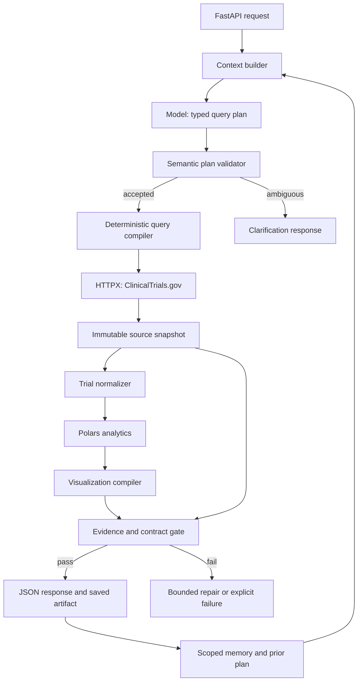

# ClinicalTrials.gov Query-to-Visualization System

**Design document · 1 October 2026 · Proposed architecture**

This document translates the attached assignment brief, `Pasted markdown(20261001-180530).md`, and the context/memory discussion into an implementable backend design. It specifies the first take-home build and a production expansion. The system described here has not yet been implemented or benchmarked. Limits, budgets, and performance goals below are initial engineering choices to validate.

## 1. What we are building

A user submits a clinical-trial question, optionally with structured filters. The backend interprets the question, retrieves matching ClinicalTrials.gov records, calculates the requested analysis, and returns a documented JSON visualization specification. Every displayed value has traceable supporting records and field values.

Examples include trial counts by year, phase distributions, comparisons between intervention cohorts, recruiting trials by country, enrollment distributions, and sponsor–intervention networks. Follow-ups such as “now only recruiting trials” update a saved query plan and execute a new investigation.

The initial product is a research analytics backend. Patient eligibility matching, treatment recommendations, PubMed retrieval, and a complete registry mirror are separate future projects. A frontend is optional under the brief; JSON output is the deliverable.

**Core rule:** the model proposes the interpretation. Application code owns retrieval, arithmetic, provenance, and visualization data. Validation checks those operations; it cannot guarantee that a model has correctly understood every question.

## 2. Concrete technology decisions

Build one Python application with explicit modules, rather than distributing every logical component into a service. LangGraph runs the workflow. It does not replace the API, database, analytics engine, or application policies.

| Concern | Selected technology | Concrete responsibility |
|---|---|---|
| Language and packaging | Python 3.12, `uv`, committed lockfile | Runtime and reproducible dependencies |
| HTTP service | FastAPI + Uvicorn | Request validation, endpoints, generated OpenAPI documentation |
| Contracts and configuration | Pydantic 2 + `pydantic-settings` | Request, plan, normalized trial, visualization, evidence, and settings models |
| Workflow | LangGraph `StateGraph` | Named execution nodes, conditional branches, bounded repair, resumability |
| Model access | Official OpenAI Python SDK, Responses API, Structured Outputs | Convert a question into the supported `QueryPlan` schema |
| Initial planner model | GPT-5 Mini; resolve and record a supported snapshot at build time | A concrete baseline for the constrained planning task; promote or replace only after evaluation |
| Upstream HTTP client | HTTPX `AsyncClient` | ClinicalTrials.gov API requests, connection reuse, pagination |
| Retry policy | Tenacity plus a shared deadline and request limiter | Bounded transient retries; honor upstream retry instructions |
| Deterministic analytics | Polars | Filtering, grouping, deduplication, time buckets, histograms, contributor sets |
| Persistence | PostgreSQL 16 | Application records, evidence metadata, memory, runs, cache, job queue |
| Application database access | SQLAlchemy 2 + psycopg 3 + Alembic | Typed repositories and versioned application migrations |
| Graph checkpoint persistence | `langgraph-checkpoint-postgres`, `AsyncPostgresSaver` | Thread-scoped graph recovery; separate from application evidence tables |
| Raw records and artifacts | Local filesystem adapter initially; Amazon S3 in production | Immutable source pages, Parquet datasets, response JSON, evidence manifests |
| Observability | Structured JSON logging + OpenTelemetry; CloudWatch in production | Node timing, errors, token use, retrieval coverage, trace correlation |
| Verification | pytest, pytest-asyncio, HTTPX MockTransport, Hypothesis | API contracts, fixture-based correctness, invariants, failure recovery |
| Local deployment | Docker Compose | API, PostgreSQL, mounted artifact directory |
| Production deployment | AWS ECS Fargate, RDS PostgreSQL, S3, Secrets Manager | API and worker containers, persistent state and artifacts, credentials |
| Production identity | Cognito OIDC/JWT | Authenticated user and tenant scope, enforced by the backend |
| Later text retrieval | PostgreSQL full-text search + pgvector | Scoped lexical/vector retrieval only when text-heavy questions are added |

FastAPI/Pydantic provide the HTTP and schema foundation [1–2]. Polars provides structured transformations [3]. LangGraph explicitly separates checkpoint persistence from cross-thread stores [4–5]. Official OpenAI documentation confirms Structured Outputs and GPT-5 Mini support for that feature [6–7]. These capabilities support this design; the component boundaries and deployment choices are our engineering decisions.

**No Redis, Neo4j, standalone vector database, LangChain agent wrapper, or second agent framework is required for the first version.** Network output is a derived nodes/edges dataset, so a graph database would add infrastructure without solving an immediate requirement. pgvector remains disabled until a evaluated text retrieval use case needs it.

## 3. Logical architecture

The following components are Python modules within one deployable backend. The worker becomes a second process using the same codebase when asynchronous execution is added.



There are four important interfaces:

1. `Planner` produces a `QueryPlan`, never API syntax or executable code.
2. `Retriever` produces a `RetrievedDataset` and a coverage manifest.
3. `AnalyticsEngine` produces an `AnalysisResult` with contributor sets.
4. `VisualizationCompiler` produces a versioned `VisualizationSpec` and evidence references.

The graph passes artifact identifiers between large-data steps. Thousands of trial JSON objects do not enter model context or checkpoint blobs.

## 4. Public API and contracts

### 4.1 First-build endpoints

| Endpoint | Behavior |
|---|---|
| `POST /v1/visualizations` | Execute a bounded investigation and return structured output |
| `GET /v1/runs/{run_id}` | Retrieve persisted run status, interpretation, coverage, and output |
| `GET /v1/runs/{run_id}/evidence?datum_id=...&cursor=...` | Page through exact supporting citations for a datum |
| `GET /health/live` | Process liveness |
| `GET /health/ready` | Database and required configuration readiness; avoid a costly model call |

Production adds `POST /v1/runs` to enqueue long investigations, `POST /v1/runs/{run_id}/cancel`, and authenticated endpoints to inspect, set, or delete user preferences. Background jobs are not an implicit fallback: the caller receives a `202` response with a run URL.

### 4.2 Request

```json
{
  "query": "How many pembrolizumab trials started each year since 2015?",
  "filters": {
    "intervention": "pembrolizumab",
    "start_year": 2015
  },
  "thread_id": null,
  "preferred_visualization": "time_series",
  "include_citations": true,
  "allow_partial": false
}
```

`query` is required, trimmed, nonempty, and capped at 4,000 characters. `filters` may contain intervention, condition, sponsor, phase values, overall status values, country, study type, start year, and end year. Years must be integers with `start_year <= end_year`; enums use the versioned field registry. Optional fields have explicit null/absent semantics in the OpenAPI contract. Model output disallows unknown keys and arbitrary operators.

Authenticated identity is injected by middleware; a caller cannot choose another tenant using a request field. A `thread_id` must belong to that identity. Local single-user mode uses a configured local identity.

Explicit structured fields determine the corresponding filter. If the prose clearly contradicts them, return a clarification with both values rather than silently returning an unexpected chart. User intent outranks saved defaults. Important interpretations are echoed in the response.

### 4.3 Output

The response is a discriminated union selected by `status`:

| Status | Meaning | Visualization |
|---|---|---|
| `ok` | Retrieval completed and validation passed | Required |
| `partial` | Caller explicitly allowed incomplete retrieval | Required, with mandatory scope warning |
| `empty` | Retrieval completed; no eligible records after documented filters | Valid empty specification |
| `needs_clarification` | A consequential meaning is unresolved | Null; structured question and options |
| `unsupported` | Requested operation cannot be represented | Null; supported alternatives |
| `failed` | Infrastructure or validation failure prevented an answer | Null; typed error |

The success envelope contains `schema_version`, `run_id`, `status`, `visualization`, `meta`, and `evidence`. The brief's required visualization fields remain `type`, `title`, `encoding`, and `data`.

`meta` includes interpreted filters, cohort definitions, date basis, counting policy, units, sort order, assumptions, normalization version, source name, retrieval interval, source data timestamp when available, coverage, missing-field counts, and display truncation. A renderer can label the chart without reading hidden prompts.

Coverage tracks `pages_fetched`, `records_fetched`, `unique_nct_ids`, `eligible_unique_nct_ids`, `reported_total_before_postfilter`, `complete`, `stop_reason`, and `source_timestamp_changed`. The API's reported total is a search total, not a substitute for a calculated post-filter total.

Malformed requests return HTTP `422`. Clarification, unsupported, empty, and partial outcomes use typed HTTP `200` responses. Upstream unavailability uses `503`; a synchronous deadline uses `504`. Persist the same structured failure in run history. Authentication and authorization use `401` and `403`.

## 5. The query plan: the bridge from language to code

The model fills a constrained analysis language. It cannot invent a filter field or ask the server to execute arbitrary Python, SQL, URLs, or chart JavaScript.

Example plan for the request above:

```json
{
  "plan_version": "1",
  "intent": "time_trend",
  "cohorts": [
    {
      "cohort_id": "pembrolizumab",
      "filters": {
        "intervention": "pembrolizumab",
        "start_year": 2015
      }
    }
  ],
  "measure": "unique_trial_count",
  "dimensions": ["start_year"],
  "date_basis": "study_start",
  "time_granularity": "year",
  "phase_policy": "combined_category",
  "country_policy": "distinct_trial_per_country",
  "visualization_type": "time_series",
  "network_relation": null,
  "unresolved_fields": []
}
```

Supported plan primitives include exact enum filtering, field-search matching, year ranges, grouping, unique counting, numeric summaries, histogram binning, cohort comparisons, and predefined relationship construction. New query types compose those primitives. For example, a grouped bar chart adds a cohort dimension to the same group/count operator used by a single bar chart.

A field registry maps each supported dimension to its source field, normalized type, allowed operations, missing-value handling, and evidence resolver. The semantic validator rejects incompatible combinations, such as averaging sponsor names, using enrollment as an additive trial count, or charting trial start dates as historical recruitment status.

Ambiguous “over time” defaults to study start year and records that assumption. Explicit “historically recruiting in 2020” is unsupported in the first version: current records plus start dates do not reconstruct historical status. “Best treatment” is outside the analytics contract.

## 6. LangGraph execution and the harness

### 6.1 Named nodes

| Node | Implementation | Reads and writes |
|---|---|---|
| `load_context` | Custom `ContextBuilder` + scoped repositories | Current request, prior plan, eligible preferences |
| `interpret` | `ModelGateway` with structured output | Context → proposed `QueryPlan` |
| `validate_plan` | Pydantic + semantic validators | Proposal → accepted plan, clarification, or repair errors |
| `compile_query` | Custom allowlisted compiler | Plan → API parameter sets and post-filter specification |
| `retrieve` | `ClinicalTrialsClient` + `SnapshotRepository` | Compiled query → raw snapshot and coverage manifest |
| `normalize` | Field registry and normalizers | Snapshot → normalized tables and field provenance |
| `analyze` | Prewritten Polars operators | Tables → analysis dataset and contributors |
| `compile_visualization` | Typed chart templates | Analysis → output specification |
| `validate_output` | Evidence and output validators | Specification → accepted result or structured errors |
| `persist_result` | Database and artifact repositories | Result → saved output, episode, optional preference write |

Terminal graph states are success, partial, empty, clarification, unsupported, failure, and cancellation. Initial invocation normally requires one model call. A semantically invalid plan may receive one repair call containing validation errors. Infrastructure retries consume the same total deadline; recursion and repair loops are capped.

### 6.2 Run state

`RunState` contains the run/thread IDs, normalized request, accepted plan, compiled-query hash, dataset/snapshot IDs, analysis/artifact IDs, coverage manifest ID, validation errors, current stage, node attempt counts, token/spend usage, deadline, and cancellation flag.

Use `AsyncPostgresSaver` for restart recovery [5]. Graph checkpointing does not make tool effects exactly once. Artifact writes use deterministic keys; database writes use unique constraints and transactions. A resumed node checks for an existing successful node result before repeating work. Duplicate model calls may still occur after a crash; record attempts and budget for them.

The harness is implemented as application code: `ContextBuilder`, `MemoryManager`, `ModelGateway`, `ToolExecutor`, `BudgetManager`, `EvidenceValidator`, and tracing middleware. Each has a small interface and an independently testable policy. Most nodes call internal Python functions directly; the model does not need an autonomous open-ended tool loop for this task.

## 7. Context and memory: exact implementation

### 7.1 Context assembly

`ContextBuilder.build(stage, request, state_refs, identity)` creates a stage-specific input. It selects required instructions, the supported field registry, current request, relevant prior plan, and eligible preferences. It records a manifest of included item IDs/versions and omitted optional items.

For the planner, include the user's new question, supported semantics, effective defaults, and the previous plan if this is a follow-up. Do not include all raw trial records. For a repair call, include the proposed plan and exact validation errors. An optional future narrative writer would receive validated result rows and permitted claim/evidence IDs, with its prose validated separately. The first build uses deterministic titles and notes, so it does not require that writer.

Initial planner input budget is 12,000 tokens with a separate 3,000-token output budget, checked against the chosen model's supported limits. Required instructions and the current question are reserved first. Drop irrelevant preferences and old episodes next. Compact older conversational material into a typed state summary with original message references. If required material cannot fit, fail or clarify rather than silently removing essential filters. Record actual provider token use; these budgets are configuration, not performance guarantees.

A follow-up such as “now only recruiting trials” is interpreted against the saved plan. It creates a new plan version and retrieval run, preserving prior filters except the field explicitly changed. The user can inspect a plan diff. If the prior plan has been pruned, ask for the missing scope rather than inventing it.

Authority depends on the question: current user instructions govern desired scope, explicit saved preferences govern defaults, and source snapshots govern reported registry facts. A computation is only as sound as its inputs and semantics. Similarity scores do not establish factual authority. An old generated summary cannot override an exact source value.

### 7.2 Memory stores

| Memory type | Physical implementation | Read/write policy |
|---|---|---|
| Working state | LangGraph PostgreSQL checkpoints | Thread-scoped; artifact references rather than full datasets |
| Semantic preferences | Application `memory_items` table, JSONB and scope indexes | Validated allowed keys; current request overrides defaults |
| Prior investigations | `runs` and `episodes` tables | Query exact thread/project metadata first; store plan/result references |
| Evidence | `source_snapshots`, `trial_versions`, `evidence_values` + raw object bytes | Immutable retrieved values and provenance; refresh current-data queries |
| Procedures | Version-controlled field registry, prompt files, policy files, Python operators | Deployed code review; model cannot rewrite runtime procedures |
| Reusable artifacts | `artifacts` table + filesystem/S3 bytes | Access by authorized artifact ID, hash, schema version, and expiry |

Long-term memory is implemented with application-owned tables rather than a second generic store. LangGraph supports stores [4], but this system needs explicit revision, retention, provenance, and authorization rules; a `MemoryManager` over our repositories supplies them. We do not maintain duplicate preference truth in both `PostgresStore` and `memory_items`.

`MemoryItem` fields: ID, tenant/user/project scope, kind, key, typed value, originating message/run ID, revision, created/updated timestamps, validity interval, supersedes ID, and deleted timestamp. Only a small allowlist of keys is eligible: date basis, phase counting policy, preferred visualization, and explicit project defaults. A query-specific filter does not automatically become a permanent preference.

Memory writes are model proposals at most. The manager validates scope and value, then commits with optimistic concurrency. “Always use first-posted year” is an explicit preference change; a hallucinated clinical fact cannot enter preferences. A source timestamp, stored history, or old user statement remains labeled with its original time and provenance.

Memory reads apply tenant/user authorization and expiry before ranking. Exact key lookup is sufficient initially. If episodic semantic retrieval becomes useful, use PostgreSQL full-text search and pgvector [8] on approved summaries, combined with metadata filters. Do not use top-k retrieval to calculate exhaustive trial totals.

Initial retention policy: transient checkpoints 7 days after completion, query cache up to 24 hours, run/episode metadata 30 days, explicit preferences until changed/deleted, and user-visible artifacts with their referenced evidence 90 days. These are configurable product decisions. A failed/crashed run's intermediate evidence follows a 7-day cleanup policy. Retain shared immutable source objects while any authorized artifact references them; deletion removes private associations and schedules unreferenced objects for cleanup. Long-term replay only works while source bytes and transformation versions are retained.

## 8. Retrieval, normalization, and completeness

### 8.1 ClinicalTrials.gov adapter

Use API v2's studies collection and individual study lookup endpoints. HTTPX owns HTTP mechanics [9]. The compiler uses documented parameters such as intervention/condition searches and overall-status filters, with advanced field expressions only from tested templates. Preserve raw source fields before normalization.

The official API documentation and study structure are the integration contracts [10–12]. Some documentation pages render dynamically and the live studies endpoint could not be inspected in this design session. Therefore exact field-search grammar, accepted field aliases, and compiler behavior require live contract checks during implementation. The document does not claim those checks have passed.

Algorithm:

1. Compile semantic filters into a canonical API query and deterministic local post-filters.
2. Read the source data timestamp when available; create a retrieval manifest.
3. Fetch pages, initially requesting 500 records per page; persist successful page bytes and hash before continuing.
4. Follow upstream continuation tokens until exhausted. Keep the query semantics fixed across pages. Bound page count, record count, byte count, and elapsed time.
5. Deduplicate NCT IDs; detect conflicting versions within one traversal. Apply post-filters, recording exclusions.
6. Read the source timestamp again when available. Record any change and decide whether to restart or flag the traversal.
7. Mark coverage complete only after successful pagination termination, successful normalization, and completion of required cohort retrievals.

Query caching is keyed by canonical API parameters, field projection, source timestamp if available, and adapter version. Derived results additionally include post-filter, normalization, counting-policy, and compiler versions. Cache reuse never changes old source values in place. A “current” request refreshes on expiry; a replay request intentionally uses its old snapshot and labels it as such.

A paginated live API may change during retrieval. Exhausting continuation tokens establishes traversal completeness, not guaranteed transactionally consistent registry state. Record the retrieval interval and timestamp checks. If source refresh is detected, restart once within the budget; otherwise return a typed failure, or an explicit partial result only if allowed. A true point-in-time dataset would require a separately ingested frozen registry snapshot.

### 8.2 Normalized trial

`Trial` holds NCT ID, brief title, status, study type, phase list, study start date and precision/type, first-posted date, completion date, lead sponsor and class, collaborator list, intervention objects, conditions, enrollment count and enrollment type, country/site objects, and source version reference.

Every extracted field carries a source JSON path and raw value reference. Normalization changes the analytics representation; it never edits the source bytes. Invalid critical identity fields fail the record. Missing analytic fields become explicit null/unknown values; malformed relevant records are counted and make exhaustive affected results incomplete rather than disappearing silently.

Store date precision. A year-only value can support annual grouping; it cannot support an exact day timeline. Do not assume January 1. Keep enrollment's `ACTUAL`/`ESTIMATED` designation; enrollment describes the reported study size, not a causal measure of effectiveness.

String normalization initially trims whitespace and standardizes case for matching while preserving source labels. Use explicit curated aliases with a versioned mapping; do not let the model merge two sponsors or drugs solely from similar names. Unknown synonyms reduce recall and must be documented. Registry field search is a declared search cohort, not guaranteed exhaustive biomedical synonym resolution.

## 9. Analysis semantics and visualization compiler

| Query class | Deterministic operation | Default output |
|---|---|---|
| Trials over time | Year extraction + unique NCT count | `time_series` |
| Phase/status distribution | Category grouping + unique NCT count | `bar_chart` |
| Compare interventions | Separate cohort membership + category grouping | `grouped_bar_chart` |
| Countries with recruiting trials | Explode countries + unique `(NCT, country)` | `bar_chart` |
| Enrollment distribution | Declared numeric bins + contributing NCT sets | `histogram` |
| Enrollment vs. start year | Valid numeric/date rows; one point per trial | `scatter_plot` |
| Sponsor–intervention relations | Unique relationship pairs per trial | `network_graph` |
| Intervention co-occurrence | Unique unordered drug pairs per trial | `network_graph` |

Count each trial once within a single group. A trial can contribute to multiple groups when the dimension is genuinely multivalued. Totals across those groups need not equal the overall distinct-trial total.

Default phase handling keeps multi-phase records as combined categories, such as Phase 1/2. An explicitly requested exploded view counts a trial in each relevant phase and declares nonexclusive groups. Missing phase is labeled unknown/not applicable as appropriate; it is not forced into Phase 0.

Country views count a multi-country trial once per country. They do not imply patient counts, site counts, or country-specific recruitment. “Recruiting trials in France” initially means overall registry status is recruiting and a French location is listed. A request for individually recruiting sites requires a separate site-status policy and relevant fields, or is unsupported.

Cohort comparisons permit overlapping membership. A trial involving both requested interventions contributes to both cohorts; emit the overlap count. Do not present those cohorts as independent clinical groups.

Histograms declare bin edges, inclusion conventions, null exclusions, and enrollment-type policy. Scatter points retain NCT IDs. Zero-fill time buckets only within a declared range after complete retrieval; unknown dates remain separately counted. Partial retrieval never creates a misleading implication that an unobserved year has zero trials.

### 9.1 Networks

Sponsor–intervention graphs are bipartite. The default sponsor endpoint uses the lead sponsor. Collaborators require an explicit alternate relation. Intervention nodes initially use reported drug names plus the curated alias registry. Each edge weight is the number of distinct contributing trials; its evidence resolves both relationship endpoints.

For drug co-occurrence, use unique unordered pairs from the trial's listed drug interventions. This shows registry co-listing. Drugs may appear in different arms, so label the output “drug co-occurrence across trial records.” A request asserting combined administration requires arm-level evidence and a supported arm relation; it cannot reuse the co-listing operation.

Nodes contain `id`, `label`, `entity_type`, and an evidence reference. Edges contain `id`, `source`, `target`, `relation`, `weight`, and an evidence reference. No dangling endpoints or duplicate unordered edges are allowed. Cap the initial display at 100 nodes and 500 edges, with deterministic ranking and a truncation note; retain the full analysis artifact. Display truncation and incomplete source retrieval are different metadata fields.

### 9.2 Renderer contract

`VisualizationSpec` is a Pydantic discriminated union, one model per chart type. Cartesian specs use channel objects with field names, quantitative/ordinal/temporal/nominal types, units, labels, and explicit sort rules. Histogram specs define `bin_start`, `bin_end`, and `trial_count`. Network specs define `encoding.nodes` and `encoding.edges`; `data` contains the corresponding arrays.

The compiler chooses from prewritten templates based on accepted plan shape. The preferred chart is honored only when compatible. Titles are constructed from validated filters and measure labels. Vega-Lite can render the Cartesian subset in a later demo; Cytoscape.js can render networks. Neither is needed to produce the backend's spec, and neither controls analytics semantics.

## 10. Evidence and output validation

Provenance must survive computation. It is more than attaching a registry link to a finished chart.

`EvidenceValue` contains NCT ID, immutable snapshot ID, source JSON path, exact raw value, retrieval time, and source data timestamp when available. A derived `DatumEvidence` contains datum ID, operation and version, parameters, contributor NCT IDs, supporting evidence-value IDs, missing/excluded counts, and dataset hash.

For a trial count, code checks that the number equals the distinct contributor count. For an average, retain exact contributing numeric values and the denominator. For a zero-valued bucket, there are no contributing trial citations; support it with the complete cohort manifest, declared bucket range, and absence calculation. Merely returning an empty citation list would not establish zero.

Response evidence includes an inline preview and a paginated reference for the full contributor set. The take-home example outputs embed all citations when small. A preview must never be represented as exhaustive. A citation includes `nct_id`, `field_path`, `field_value`, `snapshot_id`, and the study-page URL; exact field/value citations satisfy the brief without inventing prose excerpts.

The gate checks:

- Request/plan/output schemas and semantic compatibility.
- Coverage state against the requested scope and partial-output policy.
- Encoding fields against actual rows; required units, labels, sort order, and finite numeric values.
- Counts and other measures recomputed from the same retained normalized inputs.
- Contributor membership, source JSON paths, and exact source values.
- Network endpoints, edge deduplication, and relation evidence.
- Cohort overlap, missing-value declarations, and normalization/version identifiers.

Recomputation checks arithmetic consistency; it does not independently prove a shared operator bug is absent. Golden fixtures and property tests provide separate verification. Schema correctness also does not prove interpretation or source truth. ClinicalTrials.gov is authoritative for the reported registry record, which may still contain sponsor-reported errors or omissions.

On failure, deterministic compilation defects fail visibly rather than being handed to a model to invent a replacement result. The system may retry transient retrieval or repair an invalid plan within its limits. It never changes a denominator, filter, or relation merely to pass a check.

## 11. Database and object layout

| Table | Key fields and purpose |
|---|---|
| `threads` | ID, tenant/user owner, current accepted plan ID, timestamps |
| `runs` | ID, thread ID, request, state, plan/version IDs, budget, coverage reference, error |
| `plans` | ID, run ID, version, accepted JSON, parent plan ID, semantic hash |
| `source_snapshots` | ID, canonical query hash, retrieval interval, timestamp, manifest, content hash, object key |
| `trial_versions` | Snapshot ID + NCT ID, normalized record, raw-object reference, version hash |
| `evidence_values` | ID, trial version, JSON path, raw value/reference |
| `datum_evidence` | Run + datum ID, operation, parameters, contributor manifest reference |
| `memory_items` | Scoped typed preferences, revision and validity/retention metadata |
| `episodes` | Run ID, compact investigation description, accepted plan/artifact references |
| `artifacts` | ID, owner, schema/version, hash, object key, size, expiry |
| `query_cache` | Canonical key, snapshot/result reference, expiry and source timestamp |
| `jobs` | Run ID, status, lease owner/expiry, attempts, next-attempt time, cancellation |

Use indexed relational columns for IDs, ownership, timestamps, and statuses; JSONB for versioned structured payloads. LangGraph manages its checkpoint tables separately. Alembic owns application migrations; initialize the checkpoint schema through the library's supported setup procedure.

Object keys are generated by the application, such as `snapshots/{snapshot_id}/pages/{page_number}.json`, `runs/{run_id}/trials.parquet`, `runs/{run_id}/contributors.jsonl`, and `runs/{run_id}/response.json`. Store SHA-256 hashes and writer versions. Never accept an object path directly from model output.

## 12. Failures, permissions, and operational limits

Initial configurable limits: 10,000 unique source trials per synchronous run, 100 MB raw retrieval bytes, a 120-second run deadline, 15-second HTTP attempt timeout, at most three HTTP attempts for a transient failure, and at most two logical planner calls including repair. Use a per-run model output cap and an account-wide configurable spend limit. Large jobs later receive separate worker budgets.

These limits are service protection choices, not claims about ClinicalTrials.gov limits. Tune them from measured runs. Retry `429`, transient connection/timeouts, and appropriate upstream `5xx` responses with jitter and remaining-deadline checks. Respect `Retry-After`. A deterministic `400` query error is a compiler/integration failure, not a reason for unlimited retries.

| Failure | Required behavior |
|---|---|
| Upstream failure after some pages | Preserve manifest; default to failure; partial only with explicit opt-in |
| Model refusal or incomplete output | Typed failure/unsupported state as appropriate; no silent JSON parsing fallback |
| Invalid enum or semantic plan | One bounded repair, then clarification or unsupported |
| Zero matching records | `empty` only after complete retrieval and filtering |
| Unknown date/enrollment | Preserve missing counts; use only fields supported by requested analysis |
| Worker crash | Resume from checkpoint and committed artifacts; lease expiry makes job reclaimable |
| Citation mismatch | Reject affected output |
| Cross-tenant artifact/thread access | Reject before loading context or bytes |
| Cancellation | Stop before the next stage/attempt; persist cancellation and clean intermediates by policy |

Structured Outputs constrain the response shape, but the gateway must still handle refusal, interruption, and semantic errors [6]. The model cannot invoke arbitrary network destinations, write SQL, or execute generated code. Free text from registry records is untrusted data, not instructions. Optional future prose retrieval labels source text and never grants it tool authority.

Production verifies JWT issuer/audience/expiry, applies tenant ownership checks in every repository path, and adds PostgreSQL row-level policies for private application tables. Public registry snapshots may be shared internally, but private searches, thread history, artifact associations, and preferences remain scoped. Keep credentials in environment configuration locally and Secrets Manager in production. Logs omit raw questions and conversation text by default; source text enters traces only through an explicit diagnostic policy.

## 13. Observability and evaluation

Each run emits a trace with node spans and run ID. Record prompt/model versions, actual token use, query/plan hashes, attempt counts, HTTP status/latency, page and record counts, cache status, completeness, source timestamp change, missing-field counts, graph stage transitions, evidence validation failures, and artifact IDs. Store brief typed interpretation decisions, not hidden chain-of-thought.

Start with a version-controlled evaluation set of 30 questions spanning the supported classes, plus fixture datasets designed to expose boundary cases. Expected outputs specify semantic plans and contributing trial sets rather than requiring identical prose.

| Evaluation layer | What is checked |
|---|---|
| Interpretation | Requested filters, date basis, cohort definitions, compatible operation |
| API compilation | Escaping, parameter mappings, fixed pagination semantics, invalid query rejection |
| Retrieval | Multi-page traversal, duplicates, version conflicts, truncation, transient failures |
| Normalization | Nulls, date precision, multi-phase/multi-country values, enrollment type |
| Analytics | Hand-calculated fixture counts, overlap, bins, network edges and contributor IDs |
| Evidence | Exact path/value resolution, complete contributor sets, zero-bucket manifests |
| Memory/context | Follow-up preservation, explicit overrides, expiry, deletion, tenant isolation |
| Recovery | Crash after a committed page/node; idempotent artifacts and bounded retry |

Property tests include trial-order invariance, duplicate-trial invariance, nonnegative counts, contributor-count equality, and repeated identical computations on frozen snapshots. Live smoke tests validate the adapter against current API behavior; they do not hardcode drifting registry totals. End-to-end example files are actual saved service responses, never illustrative invented results.

Release gates: all contract and fixture tests pass; every successful example resolves its evidence; incomplete retrieval cannot produce an unqualified `ok`; unsupported historical questions remain unsupported; no tested tenant boundary is bypassed. Planner accuracy, latency, token spend, and abstention rate are measured before selecting a production model. No accuracy or latency target is claimed to have been achieved here.

## 14. Deployment and durable jobs

The first build runs FastAPI and PostgreSQL with Docker Compose and a mounted artifact directory. Health checks, seed-free migrations, an `.env.example`, and a one-command startup are included. Pin library versions after checking compatibility together; do not install floating latest versions on deployment.

Production runs API and worker tasks on ECS Fargate using the same image. RDS stores application and checkpoint data; S3 stores source bytes and artifacts. CloudWatch receives logs, metrics, and exported traces. Secrets Manager supplies model/database credentials. Cognito authenticates callers. Enable encrypted storage, database backups, and retention cleanup jobs.

Use a PostgreSQL job queue initially. Workers claim eligible jobs in a short transaction with `FOR UPDATE SKIP LOCKED`, commit a lease, and heartbeat during execution [13]. Expired leases become reclaimable. Pair this with a per-run execution lock so a stale worker cannot concurrently publish another result. Jobs execute at least once; idempotent node/output writes are required. LangGraph checkpoints recover workflow state, while the job queue decides when and by whom execution occurs.

Scale API and workers independently once workloads warrant it. A dedicated queue or Temporal is a later replacement behind the job abstraction, not a dependency required to complete the take-home.

## 15. Repository layout

| Path | Contents |
|---|---|
| `app/main.py`, `app/api/` | FastAPI wiring, endpoints, identity and error middleware |
| `app/contracts/` | Request, plan, trial, evidence, response, and chart schemas |
| `app/agent/graph.py`, `app/agent/nodes/` | LangGraph orchestration and bounded execution |
| `app/context/`, `app/memory/` | Context manifests, preference policy, scoped reads/writes |
| `app/models/gateway.py`, `app/prompts/` | Model adapter, constrained planner prompts and versions |
| `app/clinicaltrials/` | HTTP client, compiler, field registry, normalizers |
| `app/analytics/` | Reusable filtering/grouping/binning/network operators |
| `app/visualizations/`, `app/evidence/` | Spec compiler, citation resolvers, validators |
| `app/storage/`, `app/jobs/` | Repositories, object adapter, leases and worker entrypoint |
| `migrations/`, `tests/fixtures/`, `evals/` | Schema evolution and independent verification inputs |
| `examples/`, `docs/` | Actual JSON runs, schema/semantics documentation |
| `Dockerfile`, `compose.yaml`, `pyproject.toml`, `uv.lock`, `README.md` | Runnable submission and dependency/environment instructions |

## 16. Build sequence and submission scope

The 24-hour first build should prove the complete question-to-evidence path. Implement the broader memory framework through interfaces, but prioritize the graded output over infrastructure expansion.

| Approximate effort | Deliverable |
|---|---|
| Hours 0–3 | Contracts, semantic policies, field registry, FastAPI shell, source contract checks |
| Hours 3–7 | HTTPX retrieval, pagination/coverage, raw snapshots, normalization |
| Hours 7–11 | Group/count/time/cohort operators, sponsor–drug network, evidence contributors |
| Hours 11–14 | Structured planner, LangGraph nodes, semantic validation and bounded repair |
| Hours 14–17 | Chart compiler, citation endpoint, output gate, persistence and minimal follow-up context |
| Hours 17–21 | Fixture/property/failure checks and real integration runs |
| Hours 21–24 | Three to five actual example outputs, README, schema docs, Docker startup, submission zip |

First-build acceptance: time series, phase bars, cohort comparison, recruiting-country bars, and one meaningful network are supported through shared operators. All examples include resolved source citations and declared completeness. Working state and the previous accepted plan survive restart; long-term preference management, production identity, worker scheduling, semantic episodic search, and advanced chart types follow after the submission.

Production expansion adds durable asynchronous runs, complete memory inspection/deletion, retention enforcement, authenticated multitenancy, broader evaluation, and the production deployment. Text-heavy eligibility analysis then adds full-text/vector retrieval with extraction evidence and explicit uncertainty. Patient data would require a separate access-controlled clinical data design; this registry backend does not silently turn into one.

## 17. Main tradeoffs and decisions to revisit

The first implementation uses live, query-scoped API retrieval rather than a complete local mirror. That reduces startup work and keeps source access direct, but introduces upstream latency and prevents transactional snapshot guarantees. Immutable captured datasets support replay of our own investigations.

The planner is constrained to an analysis language. That limits open-ended answers, but makes support boundaries and arithmetic inspectable. Adding a field or operator requires its semantics, evidence resolver, and tests, not merely an expanded prompt.

PostgreSQL supports application persistence and graph checkpoints in one operational footprint. Large source bytes stay outside relational tables. Separate evidence records and user memory avoid treating remembered prose as current registry truth.

GPT-5 Mini is an initial, documented structured-planning baseline, not a claim that it is the newest or best available model. Validate account availability, pin a supported snapshot, and compare semantic accuracy and total cost before production. Provider substitution must preserve the plan contract and pass the same evaluations.

The evidence gate catches specific unsupported outputs and inconsistencies. It does not certify biomedical truth or eliminate misunderstanding. Clear query interpretation, independent fixtures, missing-data policies, and honest retrieval coverage remain necessary.

## 18. Sources and implementation references

The attached assignment brief defines the deliverable. The sources below establish platform capabilities and integration entrypoints; proposed limits and component choices are design decisions.

1. [FastAPI documentation](https://fastapi.tiangolo.com/)
2. [Pydantic validation documentation](https://docs.pydantic.dev/latest/)
3. [Polars user guide](https://docs.pola.rs/)
4. [LangGraph persistence: checkpointers and stores](https://docs.langchain.com/oss/python/langgraph/persistence)
5. [LangGraph memory and PostgreSQL persistence examples](https://docs.langchain.com/oss/python/langgraph/add-memory)
6. [Official OpenAI documentation: Structured Outputs](https://developers.openai.com/api/docs/guides/structured-outputs)
7. [Official OpenAI documentation: GPT-5 Mini](https://developers.openai.com/api/docs/models/gpt-5-mini)
8. [pgvector project documentation](https://github.com/pgvector/pgvector)
9. [HTTPX documentation](https://www.python-httpx.org/)
10. [ClinicalTrials.gov API reference](https://clinicaltrials.gov/data-api/api)
11. [ClinicalTrials.gov study data structure](https://clinicaltrials.gov/data-api/about-api/study-data-structure)
12. [National Library of Medicine: API v2 announcement and migration references](https://www.nlm.nih.gov/pubs/techbull/ma24/ma24_clinicaltrials_api.html)
13. [PostgreSQL SELECT and locking documentation](https://www.postgresql.org/docs/current/sql-select.html)
