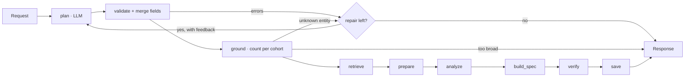

# Design: ClinicalTrials.gov Query-to-Visualization Agent

**Status:** v3, as built · 2026-10-01
**Brief:** [ASSIGNMENT.md](ASSIGNMENT.md) · **Supersedes:** v2 (the previous draft of this file) and v1 ([ClinicalTrials-System-Design.md](ClinicalTrials-System-Design.md)). Changes and reasons are in [Appendix A](#appendix-a-changes-from-v2-and-v1).
**Renderer contract:** [docs/response-schema.md](docs/response-schema.md)

## 0. Decisions

| # | Decision | Choice | Why |
|---|---|---|---|
| D1 | Language | Python 3.12, `uv`, FastAPI, Pydantic v2 | Typed contracts produce the OpenAPI/JSON Schema docs for free |
| D2 | Footprint | One process. File run store and file page cache. No DB, Docker or queue | Graders run it with `uv sync && uv run`; the brief grades none of that infrastructure (Docker isn't even installed on the dev machine) |
| D3 | Orchestration | Plain async pipeline; every stage is a traced span | Fixed pipeline; a run takes 1–30 s, so re-running beats resuming (pages are cached) |
| D4 | LLM | OpenAI only (≤ `gpt-5.4`, Cheiron constraint); default **`gpt-5.4`**, configurable | Chosen by E1 (§12): 102/102 and 34/34 stable, vs mini at 101/102 (its miss would have shipped a misleading chart). The cost is about 0.5 s of latency and the same ~3.8k tokens per run |
| D5 | LLM role | Writes a `QueryPlan` and nothing else (≤ 2 calls). Never sees trial records; never produces numbers, titles or chart data | Avoids hallucination-prone steps (§7: 20%) |
| D6 | Chart type | **Derived by code** from the operation, the dimension kinds and data exclusivity; a preference is honored only if compatible | Removes a model output that could be wrong; the rules double as validation |
| D7 | Agent loop | plan → validate → **ground** (live hit counts) → ≤ 1 repair with that feedback | A bounded tool loop with deterministic tools |
| D8 | Evidence | Each count is the size of a contributor set; citations come from the same set; a gate re-checks every excerpt | Deep citations (bonus) that cannot drift from the numbers |

## 1. Problem, users, goal

**Problem.** ClinicalTrials.gov holds the data for landscape questions, but turning it into a chart is manual:
- learning the search syntax;
- paging through nested JSON;
- cleaning messy fields (multi-phase trials, drug-name variants, partial dates, multi-country trials);
- counting, then charting.

Each step involves silent judgment calls, so the numbers are hard to defend.

**Users.** Analysts (CI/BD, clinical operations, research) whose charts go into decks and get asked "where did this number come from?".

**Goal.** Question (+ optional fields) → validated plan → registry data → deterministic analysis → typed spec. Every datum cites the exact source values behind it, and every judgment call is stated in `meta`.

**Non-goals:** patient matching, treatment advice, efficacy or results analysis, historical recruitment status.

### 1.1 Brief → design traceability

| Brief requirement | Met by | Proven by |
|---|---|---|
| §1 Interpret | `plan` + `validate` + `ground` (§3, §6) | Planner evals, 34 cases (§12) |
| §1/§2 Retrieve from the authoritative source | `retrieve` (§7) | Mocked-API pipeline tests; live smoke runs; citation audit |
| §1 Choose the visualization | Chart rules (§9) | Unit tests per rule |
| §3.1 Request schema, documented and validated | §5.2; `docs/schemas/request.schema.json` | `tests/test_request.py` |
| §3.2 `type/title/encoding/data` + metadata, documented | §5.3; [docs/response-schema.md](docs/response-schema.md); JSON Schema; `/v1/capabilities` | Schema tests; the `/demo` renderer uses only documented fields |
| §4 Multiple chart types from one approach | Registry + 5 operators → 8 chart types | `tests/test_coverage.py`; evals cover every appendix class |
| §5 Deep citations | Contributor sets + membership evidence (§10) | `verify` gate on every run; `scripts/audit_citations.py` (live) |
| §6 README, 3–5 real example runs | `examples/` from `scripts/run_examples.py` | Reviewed with `scripts/review_run.py` |
| §7 System design (35%) | §3, §6–§8 | Golden tests on hand-computed corpora |
| §7 AI design (20%) | D5–D7, §6 | Evals: 102/102 with gpt-5.4; E2 shows the repair loop's value |
| §7 Code quality (20%) | §14, CI | ruff, mypy, 106 offline tests |
| §7 I/O design (10%) | §5 | JSON Schema export, OpenAPI |
| §8 Tools, validation, deliberate vs generated | README "How this was built" | Commit history |

**Guardrail:** any feature that doesn't trace to a row above goes into §16 (production path) instead of being built.

## 2. Principles

1. **The model proposes, code decides.** LLM output is a strict-schema `QueryPlan`: no numbers, URLs, query syntax or code.
2. **Every number is the size of a set.** `Bucket.count == len(contributors)`, and the citations come from that same set.
3. **Declare, don't guess.** Defaults and data gaps go into `meta`. Ambiguity → clarification. Incomplete retrieval is never returned as `ok`.
4. **One operator set.** A new question class = a registry entry plus existing operators.
5. **Measured.** Every run is traced; every planner change is scored on the eval set.

## 3. Pipeline



| Stage | Does | Code |
|---|---|---|
| `plan` | question + fields (+ parent plan) → `QueryPlan` via Structured Outputs (`responses.parse`) | `planner/` |
| `validate` | cross-field rules; merges structured fields (prose contradicting a field → clarify) | `planner/validate.py` |
| `ground` | `countTotal` per cohort. If a cohort has 0 hits, each free-text entity is counted alone to find the unknown one. Over the cap → clarify before fetching | `planner/grounding.py` |
| `retrieve` | paged fetch (1,000/page) with field projection, cache, rate limiter, retries | `ctgov/` |
| `prepare` | dedupe; re-check exact filters locally; record membership evidence; count synonym-only matches | `analytics/prepare.py` |
| `analyze` | one of 5 operators → rows + contributor evidence | `analytics/` |
| `build_spec` | chart rules → typed spec, citations, deterministic title, policies | `viz/build.py` |
| `verify` | output gate (§10); a failure returns `failed` and nothing is patched | `viz/verify.py` |
| `save` | request, response, trace and full evidence → `data/runs/` | `storage.py` |

**The model's view:** only the question, its own plan, validator errors and hit counts. Trial text never reaches it, so registry content can't inject instructions.

## 4. Tech stack

| Concern | Choice |
|---|---|
| API | FastAPI + Uvicorn; Pydantic v2; `pydantic-settings` (`.env`) |
| LLM | `openai` SDK, Responses API, strict Structured Outputs. The schema's enums come from the registry (a test checks strict-mode validity offline) |
| Upstream | `httpx` async. Token-bucket limiter at 40/min, burst 5: the API returns 429 on bursts with no rate headers. Retries on 429/5xx (1–8 s with jitter, honors `Retry-After`); 4xx is never retried |
| Analytics | Plain Python sets and dicts. ≤ 30k trials per cohort, so Polars buys nothing, and sets make contributor tracking structural |
| Storage | JSON run records + an evidence sidecar per run; a page cache keyed by params + registry `dataTimestamp` (24 h TTL) |
| Tracing | `app/telemetry.py`: a ContextVar span tree (OTel-shaped: id, parent, start, duration, attributes, status) saved per run |
| Quality | pytest (mocked registry via `httpx.MockTransport`, scripted planner), ruff, mypy, GitHub Actions |

## 5. API contract

### 5.1 Endpoints

| Endpoint | Purpose |
|---|---|
| `POST /v1/visualizations` | Question → response envelope |
| `GET /v1/runs/{run_id}` | The stored response |
| `GET /v1/runs/{run_id}/evidence?datum_id=&offset=&limit=` | Every citation for one datum |
| `GET /v1/runs/{run_id}/trace` | Span tree: stages, LLM calls (tokens), registry requests (cache hit, attempts) |
| `GET /v1/capabilities` | Dimensions, measures, operators, chart rules, limits (from the registry) |
| `GET /health` · `GET /demo` · `GET /docs` | Liveness · reference renderer · OpenAPI UI |

CLI: `uv run python -m scripts.ask "…" [--field k=v] [--plan plan.json]`. With `--plan`, a hand-written plan replaces the model call but still goes through validation and grounding.

### 5.2 Request

Structured fields are top-level and use the brief's names, so the brief's example request works unchanged. Unknown fields → `422`.

| Field | Type | Validation / meaning |
|---|---|---|
| `query` | string, **required** | trimmed, 1–2,000 chars |
| `drug_name` | string ≤ 200 | `AREA[InterventionName]` or `AREA[InterventionOtherName]` phrase (the registry expands synonyms) |
| `condition` | string ≤ 200 | `query.cond` phrase (the registry expands synonyms) |
| `sponsor` | string ≤ 200 | `AREA[LeadSponsorName]` phrase |
| `country` | string ≤ 200 | `AREA[LocationCountry]` phrase |
| `trial_phase` | phase or list | accepts `PHASE3`, `Phase 3`, `3`, `III`, `1/2`, `N/A` |
| `overall_status` | status or list | accepts `RECRUITING`, `"active, not recruiting"` |
| `study_type` | enum | `INTERVENTIONAL` / `OBSERVATIONAL` / `EXPANDED_ACCESS` |
| `start_year`, `end_year` | int 1900–2100 | `start ≤ end`; applies to the plan's date basis |
| `preferred_visualization` | chart type | honored only if compatible (§9) |
| `citations_per_datum` | int 0–100, default 5 | inline citations; full sets via `/evidence` |
| `parent_run_id` | UUID | follow-up: refine that run's plan |

### 5.3 Response

The envelope is `{schema_version, run_id, status, visualization, meta, clarification, error}`. `status` is one of `ok`, `empty`, `needs_clarification`, `unsupported` or `failed`.

- **8 spec types:** `bar_chart`, `grouped_bar_chart`, `stacked_bar_chart`, `pie_chart`, `time_series`, `histogram`, `scatter_plot`, `network_graph`. Each is a Pydantic model, discriminated on `type`.
- **Channels:** `{field, type, title, unit?, sort?}`.
- **Datum:** `{datum_id, trial_count, citation_count, citations_truncated, citations[]}`.
- **Citation:** `{nct_id, url, brief_title, evidence[{field_path, excerpt}]}`.

Full field-by-field documentation is in [docs/response-schema.md](docs/response-schema.md).

## 6. Query plan and registry

```json
{
  "cohorts": [{"label": "pembrolizumab", "filters": {"drug_name": "pembrolizumab", "condition": "melanoma",
               "sponsor": null, "country": null, "trial_phase": null, "overall_status": null, "study_type": null}}],
  "operation": {"kind": "count_by", "dimension": "phase", "second_dimension": null, "measure": null, "x_measure": null},
  "time": {"date_basis": "start_date", "year_from": null, "year_to": null},
  "phase_policy": "combined", "top_n": null, "clarification": null, "unsupported_reason": null
}
```

The model can decline by setting `clarification` or `unsupported_reason` instead of forcing a plan.

**Operators**

| `kind` | Parameters | Chart |
|---|---|---|
| `count_by` | `dimension`, `second_dimension?` (series; cohorts are series when comparing) | `bar_chart` / `grouped_bar_chart` (+ `pie_chart`, `stacked_bar_chart` when exclusive) |
| `time_trend` | `time.date_basis`, `second_dimension?` | `time_series` |
| `histogram` | `measure` ∈ {enrollment, duration_months} | `histogram` |
| `scatter` | `x_measure`, `measure` (numeric y), `dimension?` (single-valued colour) | `scatter_plot` |
| `network` | `dimension`, `second_dimension`: entities (the same entity twice = co-occurrence) | `network_graph` |

**Validation rules** (errors are worded for the repair call):
- unused operation fields must be null;
- parameters must match `kind`;
- networks take entity dimensions only, with exactly one cohort;
- histograms need a binned measure;
- scatter colour must be single-valued;
- 1–4 cohorts with unique labels;
- `year_from ≤ year_to`;
- `top_n` between 1 and 100.

**Registry** (`app/registry.py`): one entry per field, giving its source path, kind, extractor (value + exact path + raw value), display order, default top N and exclusivity.

| Dimension | Source (`protocolSection.…`) | Kind |
|---|---|---|
| `phase` | `designModule.phases` | category (combined/split policy) |
| `overall_status`, `study_type`, `primary_purpose`, `allocation` | `statusModule.overallStatus`, `designModule.{studyType, designInfo.*}` | category, single-valued |
| `sponsor_class` / `lead_sponsor` | `sponsorCollaboratorsModule.leadSponsor.{class, name}` | category / entity |
| `intervention_type` | `armsInterventionsModule.interventions[].type` | multi-category |
| `drug` | `interventions[].name`, type ∈ DRUG, BIOLOGICAL, COMBINATION_PRODUCT, placebo excluded | multi-entity |
| `condition` | `conditionsModule.conditions[]` | multi-entity |
| `country` / `site` | `contactsLocationsModule.locations[].{country, facility}` | multi-entity |
| `investigator` | `contactsLocationsModule.overallOfficials[].name` (placeholders such as "Medical Director" dropped) | multi-entity |

| Measure | Source | Notes |
|---|---|---|
| `enrollment` | `designModule.enrollmentInfo.{count,type}` | bins 0, 10, 25, 50, 100, 250, 500, 1k, 2.5k, 5k, 10k+ |
| `duration_months` | start → primary completion date | needs month precision on both dates; bins 0, 6, 12, 18, 24, 36, 48, 60, 84, 120+ |
| `start_date` | `statusModule.startDateStruct.date` | temporal (scatter x) |

## 7. Retrieval

**API facts, verified live on 2026-10-01:**
- `pageSize` is capped at 1,000. A projected page is about 2.2 MB and takes about 0.7 s.
- `/version` returns `apiVersion` 2.0.5 and `dataTimestamp`, which is refreshed daily.
- Bursts get HTTP 429 with no limit headers.

| Filter | Compiled to | Verified |
|---|---|---|
| drug | `query.term=(AREA[InterventionName]"X" OR AREA[InterventionOtherName]"X")` | pembrolizumab = MK-3475 = keytruda = 2,631 (the broad `query.intr` gives 2,964, because it includes trials that only mention the drug) |
| condition | `query.cond="X"` | the phrase is narrower than any-word ("lung cancer": 13,362 vs 14,593); synonyms are kept |
| sponsor / country / phase / study type / years | `AREA[LeadSponsorName]"X"`, `AREA[LocationCountry]"X"`, `AREA[Phase](…)`, `AREA[StudyType]X`, `AREA[StartDate]RANGE[…]`, AND-ed | ✔ |
| status | `filter.overallStatus=A,B` | ✔ |

- **Injection-safe:** user text is stripped of `" [ ] ( )` and quoted, so `"x OR y"` is a literal phrase (0 hits). An unknown `AREA` returns 400, which is treated as a compiler bug and not retried.
- **Cap:** 30,000 trials per cohort (about 25 s), checked at grounding. Above it → `needs_clarification` with narrowing options; an unscoped question (605k trials) asks the user to narrow.
- **Completeness:** `complete` is true only when pagination ends normally. A mid-run upstream failure → `failed`, never a silent partial result.
- **Local re-check:** phase, status, study type and year range are re-checked on every record; failures are excluded and counted by reason.

## 8. Normalization and counting policies (echoed in `meta.policies`)

| Topic | Policy |
|---|---|
| Multi-phase | Combined category (`Phase 1/2`) by default; with `split`, the trial counts in each phase and the groups are marked non-exclusive |
| Missing values | `Not applicable` (NA) is a real phase. Absent values are counted in `meta.cohorts[].missing` and not charted |
| Dates | Precision is kept; dates are never padded to January 1. A duration needs month precision on both ends. ESTIMATED dates are included and counted per bucket (`estimated_date_count`) |
| "Over time" | Start date by default (stated in assumptions). Buckets are zero-filled inside the range, and the current partial year is flagged |
| Countries / sites | A trial counts once per distinct country or site. Sponsor site numbers (`( Site 5303)`) are stripped |
| Cohort overlap | A trial in two cohorts counts in both; `meta.cohort_overlap` reports it. Stacked or pie charts are refused when groups overlap |
| Drug names | The grouping key drops case, ®/™, dose suffixes (`80 mg`) and salt words (`hydrochloride`, `HCl`, …). The label is the most frequent spelling. Brand and generic names are not merged, and the model never merges entities |
| Free-text membership | A literal match is cited with token matching ("Alzheimer's disease" ≈ "Alzheimer Disease"). Registry synonym matches (MK-3475 for pembrolizumab) are counted in `synonym_matches` |
| Co-occurrence | Means *co-listed in one trial record*, not "given together" |
| Enrollment | ACTUAL and ESTIMATED are mixed, and each citation shows which; never summed as a trial count |

## 9. Charts (deterministic rules, `viz/build.py::choose_chart`)

| Analysis | Default | Preferred type honored when |
|---|---|---|
| `count_by`, no series | `bar_chart` (horizontal for entities) | `pie_chart`: categories are mutually exclusive and there are ≤ 12 |
| `count_by` with series | `grouped_bar_chart` | `stacked_bar_chart`: series are mutually exclusive (single-valued dimension, or disjoint cohorts) |
| `time_trend` | `time_series` | `bar_chart` / `grouped_bar_chart` / `stacked_bar_chart` (the last only if exclusive) |
| `histogram`, `scatter`, `network` | `histogram`, `scatter_plot`, `network_graph` | none |

A declined preference is explained in `meta.chart_selection` and `meta.assumptions`.

**Networks:**
- Edge weight = the number of distinct trials linking the two nodes.
- The display keeps the strongest edges first, capped at 40 nodes and 150 edges with deterministic tie-breaks, and reports `meta.truncation`.
- There are no dangling endpoints, self-loops or duplicate pairs.

## 10. Evidence and the `verify` gate

- **Contributors.** `Bucket.add(trial, label, evidence)` stores the trial's membership evidence (why it's in the cohort) plus the placement evidence (why it's in this bar, bin, point or edge). Placement includes both endpoints for edges, and both values for scatter points.
- **Citations.** Inline citations show the first N contributors (highest NCT ID first). The full set is saved per datum and paginated by `/evidence`.

**The gate** runs on every response before it leaves:
- every encoded field is present in every row;
- `citation_count == trial_count`, and the truncation flag is correct;
- there are no duplicate datum IDs or citations;
- **every `field_path` re-resolves to its `excerpt`** in the retrieved record;
- network integrity holds.

A failure → `failed` (500), with the errors listed.

**Audit:** `scripts/audit_citations.py <run_id>` re-fetches a sample of cited trials live and re-compares every excerpt. On two smoke runs, 86/86 excerpts matched.

## 11. Storage

`data/runs/<run_id>.json` holds `{run_id, created_at, request, response, trace}`; `data/runs/<run_id>.evidence.json` holds `{datum_id: [citations…]}`. The `RunStore` Protocol is the seam for a database.

Page cache: `.cache/ctgov/<sha256>.json`, keyed by (adapter version, path, params, `dataTimestamp`), with a 24 h TTL.

**Follow-ups:** with `parent_run_id`, the planner receives the parent's accepted plan as `previous_plan` and returns a complete new plan. `meta.interpretation.plan_diff` lists the changed leaves.

## 12. Observability, evaluation, review

- **Trace (per run):**
  - spans `run` → `stage.{plan, retrieve, analyze, build, verify}`;
  - children `llm.propose` (model, attempt, tokens) and `ground` (totals, unknown terms);
  - `ctgov.request` (path, params, cache hit/miss, attempts, records, total).
  - Stage durations are also copied into `meta.timings_ms`, and tokens into `meta.llm_usage`.
  - No raw records or chain-of-thought are stored.

**Tests (offline, in CI)**

| Layer | Checks |
|---|---|
| Unit | phase/status parsing, compiler, registry extractors, drug/site/investigator normalization, chart rules, strict-schema validity |
| Golden | hand-computed counts and contributor sets for every operator (`test_analytics.py`, `test_coverage.py`) |
| Invariants | record-order independence, explicit zeros, no dangling or duplicate edges |
| Pipeline | mocked registry (pagination, grounding, too-broad, upstream failure, typo → repair, follow-up diff, gate catches tampering) |
| API | status codes, evidence/trace endpoints, path traversal, the demo page |

**Planner evals** (`evals/cases.yaml`, 34 cases; `uv run python -m evals.run --model … --repeats 3`):
- **Classes:** time trends, distributions, comparisons, geography, networks, histogram/scatter, structured fields, clarification, unsupported, robustness (misspelling, injection, unscoped).
- **Scoring:** deterministic field matching (token-insensitive strings, order-free sets). There is no LLM judge: expected plans are structured, so exact comparison is cheaper, reproducible and can't itself hallucinate.
- **Reports:** pass rate per class, first-try passes, repair use, stability across repeats, tokens, latency.
- **Experiments:** E1 compares models (`gpt-5.4-nano` / `-mini` / `gpt-5.4`); E2 compares with and without the repair call (`--no-repair`).

| Prompt v5, 3 repeats | Pass | Stable | Median latency |
|---|---|---|---|
| gpt-5.4-nano | 97/102 | 30/34 | 2.2 s |
| gpt-5.4-mini | 101/102 | 32/34 | 2.0 s |
| **gpt-5.4** | **102/102** | **34/34** | 2.5 s |
| gpt-5.4-mini, no repair (E2) | 99/102 (the misspelling case fails 3/3) | 34/34 | 2.1 s |

Prompt v3 → v5 changes each answer a specific eval failure. The full history is in [evals/results/README.md](evals/results/README.md).

**Review:**
- `scripts/review_run.py <run_id>` renders a Markdown sheet (plan, coverage, data, 3 citations per datum).
- Every example is reviewed with it.
- Planner misses become eval cases.

## 13. Limits and failures

**Defaults** (env-configurable):
- 30k trials per cohort and 4 cohorts;
- 90 s run deadline;
- 15 s HTTP timeout with 4 attempts;
- 2 planner calls;
- networks: 40 nodes / 150 edges;
- scatter: 3,000 points;
- 5 inline citations per datum.

| Failure | Behavior |
|---|---|
| Malformed request | `422` |
| Plan still invalid after the repair call | `unsupported` (`plan_invalid`, with the errors) |
| Unknown entity after the repair call | `needs_clarification` naming the term |
| Over the cap | `needs_clarification` (narrowing options), before any page fetch |
| Every entity exists but the combination has 0 trials | `empty`, with the reason |
| Upstream failure | `failed` 503; never partial |
| Model refusal or truncated output | `failed` 503; no free-text parsing |
| Gate failure | `failed` 500 |
| Missing `parent_run_id` | `failed` 404 |

Secrets live in `.env` (gitignored); `.env.example` is committed.

## 14. Repository layout

```
app/  main.py config.py factory.py pipeline.py storage.py telemetry.py registry.py
      contracts/{request,plan,response,enums}.py   planner/{__init__,gateway,prompt,validate,grounding}.py
      ctgov/{client,compile,cache}.py   analytics/{prepare,count_by,time_trend,histogram,scatter,network,types}.py
      viz/{build,verify}.py   static/demo.html
evals/{cases.yaml,run.py,scoring.py}   scripts/{ask,run_examples,review_run,audit_citations,export_schemas,check_openai}.py
tests/   examples/   docs/{response-schema.md,schemas/}
```

## 15. Build log

| Step | Delivered |
|---|---|
| v1 MVP | contracts, registry, compiler, client + cache + limiter, `count_by` / `time_trend` / `network`, spec builder, gate, 71 tests |
| v3 | histogram, scatter, trend split, 4 dimensions, 3 measures; chart rules + pie/stacked; grounding repair loop; membership evidence + `excerpt`; traces; evidence/trace endpoints; follow-ups; evals; demo; review/audit scripts; CI |

## 16. Production path (documented, not built)

- **Storage and execution:** Postgres for runs, evidence and cache, plus S3 for pages; an async job queue for large cohorts; auth and tenancy.
- **Unscoped questions:** answer them with per-bucket `countTotal` queries plus sampled citations, instead of fetching every record.
- **Entity resolution:** MeSH-backed (`derivedSection.*BrowseModule`), with a reviewed alias table.
- **Tracing:** export spans to an OTLP collector such as Arize Phoenix, and collect human labels there into eval cases.
- **AWS deployment** (as in v1's production section): ECS Fargate, RDS, S3, Secrets Manager.

---

## Appendix A: Changes from v2 (and v1)

| v2 plan | v3 as built | Why |
|---|---|---|
| Postgres + Alembic, Docker Compose, Phoenix (in a later version) | JSON run store + evidence sidecar + file page cache; no Docker | Docker isn't available on the dev machine; graders should only need `uv`; persistence isn't graded. Evidence, traces and follow-ups still work |
| Resumable stage runner | Plain pipeline with spans | Runs take 1–30 s; with cached pages, re-running is cheaper than resuming |
| LLM picks `chart` | Code derives the chart; preferences are checked for compatibility | Removes a redundant model output; adds pie/stacked charts with exclusivity checks |
| Zero hits → clarify | Grounding feeds the one repair call; an entity probe separates unknown terms from genuine zeros | Fixes misspellings without asking; a genuine zero becomes `empty`, not a question |
| Citation `{nct_id, field_path, value}` | `{…, brief_title, evidence[{field_path, excerpt}]}` with membership evidence | One citation shows why the trial is in the cohort *and* in the bucket; `excerpt` is the brief's term |
| Curated alias table | Deterministic drug canonicalizer (dose, salt, ®) | Measured: raw names split erlotinib / erlotinib hydrochloride; MeSH terms mix in non-drugs ("Radiotherapy") |
| OTel → Phoenix | In-process span tree saved per run (OTel-shaped) | Same inspection with no extra service; export is a thin adapter (§16) |
| count_by, time_trend, network; 4 chart types | + histogram, scatter, trend split; 8 chart types; + primary_purpose, allocation, site, investigator | Coverage (§7: 15%) using the same operator approach |
| 20k cap, 10 citations | 30k cap (measured ~25 s), 5 inline + paginated full set | Measured page cost; smaller responses |

**v1 → v2** (kept): plain runner instead of LangGraph; the brief's top-level field names; no `partial` status; API facts verified live; evals and tracing added; v1's production expansion moved to §16.
