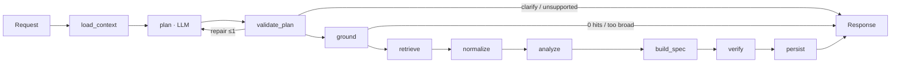

# Design: ClinicalTrials.gov Query-to-Visualization Agent

**Status:** proposed plan, pre-implementation · 2026-10-01
**Brief:** [ASSIGNMENT.md](ASSIGNMENT.md) · **Supersedes:** `ClinicalTrials-System-Design.md` (v1). What changed and why is in [Appendix A](#appendix-a-changes-from-v1).

## 0. Decisions

| # | Decision | Choice |
|---|---|---|
| D1 | Language | Python 3.12 |
| D2 | Scope | v1's first-build scope, built MVP-first in versions v0–v4 (§16). v1's *production expansion* (AWS, auth, job queue) is documented only (§17) |
| D3 | Orchestration | Plain Python stage runner, no LangGraph (§3) |
| D4 | LLM | OpenAI only, from the allowed list (≤ `gpt-5.4`). Default planner `gpt-5.4-mini`, configurable |
| D5 | LLM role | Planner only, plus at most one repair call. The LLM never produces numbers or chart data and never sees trial text |
| D6 | Tracing / eval / review | OpenTelemetry → Arize Phoenix; in-repo eval harness; CI quality gates (§11–13) |
| D7 | Frontend | None. Backend + documented spec only (the brief makes a UI optional and doesn't grade it) |

## 1. Problem, users, goal

**Problem.** ClinicalTrials.gov holds the data to answer landscape questions such as "how has activity for drug X changed?" or "who sponsors what in condition Y?". Getting a chart out of it today is manual:
- learning the search syntax;
- paging through nested records;
- cleaning messy fields (multi-phase trials, about 500 spellings of one drug, partial dates, trials in many countries);
- counting and grouping in a spreadsheet;
- charting the result.

Each step involves silent judgment calls, and the resulting numbers are hard to defend.

**Users.** Analysts making decisions from the registry: competitive intelligence, business development, clinical operations and feasibility, investors, and researchers. Their charts end up in decks, and someone will ask "where did this number come from?"

**Goal.** `POST` a clinical-trial question, optionally with structured fields. The service turns it into a validated **query plan**, retrieves the matching records from the ClinicalTrials.gov API, computes the analysis deterministically, and returns a **typed visualization spec** that a frontend can render without guessing. Every datum carries the NCT IDs and exact source field values behind it, and every judgment call is stated in `meta`.

**Non-goals:** patient-trial matching, treatment advice, reconstructing historical recruitment status, summarizing trial results text.

### 1.1 Brief → design traceability

Every hard requirement and grading criterion in [ASSIGNMENT.md](ASSIGNMENT.md) maps to the part of the design that meets it and the thing that proves it.

| Brief requirement | Met by | Proven by |
|---|---|---|
| §1 Interpret the question | `plan` + `validate_plan` (§3, §6) | Planner evals (§13.2) |
| §1 Retrieve from ClinicalTrials.gov; §2 it is the authoritative source | `ground` + `retrieve` (§7) | Live contract tests, golden tests |
| §1 Decide whether / which visualization | Plan → chart mapping (§9); status union (§5.3) | Evals check chart type and status |
| §1 / §4 Answer is a structured visualization spec, renderable reliably | Typed spec union (§5.3) | OpenAPI snapshot, schema tests |
| §3.1 Accept `query` (required) + optional fields, documented with validation | Request schema (§5.2) | `/docs`, request tests |
| §3.2 `type`, `title`, `encoding`, `data` + metadata (units, sort, granularity, notes) | Response (§5.3) | `verify` gate (§10) |
| §3.2 Response schema documented for a frontend engineer | OpenAPI + `docs/` (one JSON Schema + example per chart type) + `/v1/capabilities` | Schema tests validate every example and eval output against the published schemas |
| §4 Multiple chart types, broad coverage from a single coherent approach | Registry + 5 operators (§6, §9) | Evals cover every appendix class |
| §5 Bonus: deep citations (`nct_id` + exact value per datum) | Contributor sets → citations (§10) | Gate + `audit_citations.py` |
| §6 Code, README, 3–5 actual example runs, zip | M6 (§16) | Examples are saved real responses, reviewed with `review_run.py` |
| §7 System design (35%): rational, extensible, handles real-world data | §3, §6–§8, §11 | Golden + property tests |
| §7 AI design (20%): avoid hallucination, validation, sensible planning | D5, §6, §10, §14 | Evals E1–E4, repair rate |
| §7 Code quality (20%) | §4, §15 | CI: ruff, mypy, pytest |
| §7 I/O design (10%) | §5 | OpenAPI snapshot |
| §8 README: tools used, how correctness was validated, deliberate vs generated | §12–§13 produce the evidence | README integrity section |

### 1.2 Guardrails against scope creep

1. **The graded path comes first.** M1 delivers a complete question-to-cited-chart path before any infrastructure beyond what it needs.
2. **Every feature traces to a row in §1.1.** Anything that doesn't is moved to §17 (production path).
3. **Each milestone review re-checks §1.1** and the time left. If the remaining time can't cover the graded rows, cut infrastructure before cutting coverage or evidence.

## 2. Principles

1. **The model proposes, code decides.** LLM output is a `QueryPlan` and nothing else. It cannot contain numbers, URLs, SQL or code.
2. **Every number has contributors.** A count is the size of a set of NCT IDs. Citations come from the same set, so the two can't drift apart.
3. **Declare, don't guess.** Ambiguity becomes either a stated assumption or a clarification. Incomplete retrieval is never returned silently as a full answer.
4. **One operator set, many questions.** A new question class is a registry entry plus a composition of existing operators.
5. **Everything is measured.** Every run is traced, and every planner change is scored against a fixed eval set.

## 3. Architecture



| Stage | Input → output | LLM |
|---|---|---|
| `load_context` | request (+ parent run's plan) → planner context | – |
| `plan` | context → `QueryPlan` via Structured Outputs | ✔ |
| `validate_plan` | plan → accepted / one repair / `needs_clarification` / `unsupported` | repair only |
| `ground` | plan → hit count per cohort; 0 hits → clarify; over cap → ask to narrow | – |
| `retrieve` | plan → raw page snapshot + coverage manifest | – |
| `normalize` | raw pages → `Trial` table, each value with its source JSON path | – |
| `analyze` | trials → result rows + contributor sets | – |
| `build_spec` | result → `VisualizationSpec` + citations + `meta` | – |
| `verify` | spec → pass, or a typed failure | – |
| `persist` | result → `runs`, evidence, artifacts | – |

**Stage runner, which replaces LangGraph.** Each stage is a plain function `(RunContext) -> StageOutput`. The runner:
- writes a `run_stages` row (status, attempt, timing, output reference);
- opens a tracing span;
- enforces the run deadline;
- on resume, skips stages that already have a committed output.

That gives us the same resumability as LangGraph checkpointing in about 100 lines we fully control. Stage names match v1's node names, so LangGraph could be swapped in later.

## 4. Tech stack

| Concern | Choice |
|---|---|
| Runtime, packaging | Python 3.12, `uv`, committed lockfile |
| HTTP API | FastAPI + Uvicorn; Pydantic v2; `pydantic-settings` |
| LLM | `openai` SDK: Responses API + Structured Outputs (`responses.parse` with Pydantic). Falls back to Chat Completions `parse` if the provided base URL lacks the Responses API |
| Upstream HTTP | `httpx.AsyncClient` + `tenacity`; client-side rate limiter |
| Analytics | Plain Python sets in v1 (contributor sets built in); Polars only if profiling needs it |
| Database | PostgreSQL 16; SQLAlchemy 2 (async) + psycopg 3; Alembic |
| Artifacts | Local directory `./data/artifacts` behind a storage interface (S3-ready) |
| Tracing | OpenTelemetry SDK + instrumentation (FastAPI, httpx, SQLAlchemy) + OpenInference OpenAI instrumentation → **Arize Phoenix** |
| Logging | `structlog` JSON, correlated by `run_id` / `trace_id` |
| Evals & experiments | In-repo harness (`evals/`), results also logged to Phoenix experiments |
| Tests | pytest, pytest-asyncio, httpx `MockTransport`, Hypothesis |
| Code quality | ruff (lint + format), mypy, pre-commit, gitleaks, GitHub Actions |
| Local runtime | Docker Compose: `api`, `postgres`, `phoenix` |

**Why Phoenix:**
- It's open source and runs as one container.
- It's OpenTelemetry-native, so it sees the whole run (API calls, analytics, DB), not just LLM calls.
- It covers tracing, datasets, experiments and human annotation in one tool.

**Alternatives considered:**
- *Langfuse:* self-hosting v3 needs ClickHouse, Redis and blob storage.
- *LangSmith:* SaaS with an account, and oriented to LangChain.
- *The OpenAI dashboard:* sees only the model calls.
- *Jaeger:* traces only, with no evals or annotation.

Versions are pinned at M0 after a compatibility check.

## 5. API contract

### 5.1 Endpoints

| Endpoint | Purpose |
|---|---|
| `POST /v1/visualizations` | Run a question synchronously; returns the response envelope |
| `GET /v1/runs/{run_id}` | Stored request, accepted plan, status, coverage, response |
| `GET /v1/runs/{run_id}/evidence?datum_id=&cursor=` | Full, paginated citation set for one datum |
| `GET /v1/capabilities` | Supported fields, dimensions, operations, chart types, counting policies (generated from the registry) |
| `GET /health/live`, `GET /health/ready` | Liveness; readiness checks the DB and config, without calling the model |

### 5.2 Request

Structured fields are **top-level and use the brief's names**, so the brief's example request works unchanged.

| Field | Type | Req. | Validation |
|---|---|---|---|
| `query` | string | ✔ | trimmed; 1–2,000 chars |
| `drug_name` | string | | 1–200 chars; matched against intervention name and other names |
| `condition` | string | | 1–200 chars |
| `trial_phase` | `Phase` or list of them | | enum; accepts `PHASE3`, `Phase 3`, `3` |
| `sponsor` | string | | 1–200 chars; lead sponsor |
| `country` | string | | matched against location country |
| `start_year`, `end_year` | int | | 1900–2100; `start_year ≤ end_year` |
| `overall_status` | `Status` or list of them | | enum, e.g. `RECRUITING` |
| `study_type` | enum | | `INTERVENTIONAL`, `OBSERVATIONAL`, `EXPANDED_ACCESS` |
| `preferred_visualization` | `ChartType` | | honored only if compatible with the plan |
| `parent_run_id` | UUID | | must exist; marks the request as a follow-up |
| `citations_per_datum` | int | | 0–1,000; default 10 |

Unknown fields are rejected with `422`. An explicit structured field always overrides the prose. If the prose clearly contradicts it, we return `needs_clarification` showing both values.

### 5.3 Response

The top-level keys keep the brief's names (`visualization`, `meta`).

```json
{
  "schema_version": "1.0",
  "run_id": "…",
  "status": "ok",
  "visualization": {
    "type": "bar_chart",
    "title": "Pembrolizumab trials by phase",
    "encoding": {
      "x": {"field": "phase", "type": "ordinal", "title": "Phase", "sort": ["Early Phase 1", "Phase 1", "Phase 1/2", "Phase 2", "…"]},
      "y": {"field": "trial_count", "type": "quantitative", "title": "Trials", "unit": "trials"}
    },
    "data": [
      {"datum_id": "d1", "phase": "Phase 3", "trial_count": 41, "citation_count": 41, "citations_truncated": true,
       "citations": [{"nct_id": "NCT…", "field_path": "protocolSection.designModule.phases",
                      "value": ["PHASE3"], "url": "https://clinicaltrials.gov/study/NCT…"}]}
    ]
  },
  "meta": {
    "interpretation": {"summary": "…", "plan": {}, "plan_diff": null},
    "filters_applied": {}, "policies": {"date_basis": "start_date", "phase": "combined"},
    "assumptions": [], "coverage": {}, "truncation": null,
    "source": {"name": "clinicaltrials.gov", "api_version": "2.0.5", "data_timestamp": "…", "retrieved_at": "…"}
  },
  "clarification": null,
  "error": null
}
```

The values above are illustrative.

| `status` | `visualization` | Extra fields | HTTP |
|---|---|---|---|
| `ok` | required | – | 200 |
| `empty` | valid spec with no data | reason in `meta` | 200 |
| `needs_clarification` | `null` | `clarification: {question, options[]}` | 200 |
| `unsupported` | `null` | `error.supported_alternatives[]` | 200 |
| `failed` | `null` | `error: {code, message}` | 503 upstream · 504 deadline · 500 internal |

- **Visualization spec:** a Pydantic discriminated union with one model per type: `bar_chart`, `grouped_bar_chart`, `time_series`, `histogram`, `scatter_plot`, `network_graph`.
- **Channels:** each has `field`, `type` (nominal / ordinal / quantitative / temporal), `title`, and optionally `unit` and `sort`.
- **Networks:** use `encoding.nodes` / `encoding.edges`, and `data` is `{nodes: [], edges: []}`. Every node and edge has its own `datum_id` and citations.
- **Coverage fields:** `search_matches_broad`, `cohort_matches`, `records_fetched`, `unique_trials`, `excluded{reason: n}`, `missing{field: n}`, `complete`.

## 6. Query plan and field registry

The model fills this schema. Every enum (dimensions, operations, policies) is **generated from the field registry**, so Structured Outputs can't emit an unknown field even at decode time.

```json
{
  "cohorts": [{"label": "pembrolizumab", "filters": {"drug_name": "pembrolizumab", "condition": "lung cancer"}}],
  "operation": {"kind": "count_by", "dimension": "phase", "second_dimension": null},
  "time": {"date_basis": "start_date", "granularity": "year", "start_year": null, "end_year": null},
  "policies": {"phase": "combined"},
  "chart": "bar_chart",
  "top_n": null,
  "ambiguities": []
}
```

**Operations:**
- `count_by`: one dimension, optionally split by a second dimension or by cohort.
- `time_trend`
- `histogram`: on a numeric field.
- `scatter`
- `network`: two entity dimensions linked per trial. If both are the same dimension, it's a co-occurrence network.

**Semantic validator (cross-field rules).** It rejects, for example:
- a histogram on a categorical field;
- a network on non-entity dimensions;
- more than 4 cohorts;
- `end_year` before `start_year`;
- questions about historical recruitment status.

Any non-empty `ambiguities` that change the answer → `needs_clarification`.

**Field registry.** Each entry has: source path(s), kind, API filter template, normalizer, display order, allowed operations and evidence path.

| Dimension | Source path (`protocolSection.…`) | Kind |
|---|---|---|
| `phase` | `designModule.phases[]` | multi-category |
| `overall_status` | `statusModule.overallStatus` | category |
| `start_year` / `first_posted_year` / `completion_year` | `statusModule.{startDateStruct, studyFirstPostDateStruct, completionDateStruct}.date` | date |
| `country` | `contactsLocationsModule.locations[].country` | multi-category |
| `lead_sponsor` / `sponsor_class` | `sponsorCollaboratorsModule.leadSponsor.{name, class}` | entity / category |
| `intervention` / `intervention_type` | `armsInterventionsModule.interventions[].{name, type}` | multi-entity / multi-category |
| `condition` | `conditionsModule.conditions[]` | multi-entity |
| `study_type` | `designModule.studyType` | category |
| `enrollment` | `designModule.enrollmentInfo.count` | numeric |
| `site` | `contactsLocationsModule.locations[].facility` | multi-entity |
| `investigator` | `contactsLocationsModule.overallOfficials[].name` | multi-entity |

## 7. Retrieval

**API facts, verified live on 2026-10-01:**
- `GET /api/v2/studies`. `pageSize` is **capped at 1,000** (larger values are silently capped). Pagination uses `nextPageToken`, and `countTotal=true` returns `totalCount`.
- `GET /api/v2/version` returns `apiVersion` (2.0.5) and `dataTimestamp`, which is refreshed daily. We record both in `meta` and include them in cache keys.
- No rate-limit headers are returned. We use a configurable client-side limiter and retry `429` / `5xx` with jittered backoff, honoring `Retry-After`.
- **Drug matching:** `query.intr=pembrolizumab` returns 2,964 trials, and 11% of them don't list the drug as an intervention. The field-scoped search `AREA[InterventionName]X OR AREA[InterventionOtherName]X` returns 2,631, **and still recognises synonyms** (MK-3475 and Keytruda return the same set). We use the field-scoped form for cohort membership and report the broad count as `search_matches_broad`.
- **Scale:** pembrolizumab is 3 pages; "lung cancer" is 14,593 trials (15 pages); a question with no scope can match hundreds of thousands. One trial lists about 1,660 sites, so we always request only the fields we need (`fields=` projection).

**Algorithm:**
1. Read `/version`.
2. Ground: run `countTotal` per cohort. Zero hits → clarify. Over the cap (default 20,000 per cohort) → `needs_clarification` with narrowing suggestions.
3. Fetch pages with projected fields and store each page in the artifact store with a SHA-256 hash.
4. De-duplicate NCT IDs and apply local post-filters, recording each exclusion and its reason.
5. Mark `complete` only when pagination ends normally.

**Cache:** a `query_cache` table keyed by (canonical params, fields, `dataTimestamp`, adapter version), with a 24 h TTL.

The condition-search semantics (`query.cond` vs `AREA[Condition]`) get a contract test at M0.

## 8. Normalization and counting policies

| Topic | Policy (stated in `meta.policies`) |
|---|---|
| Multi-phase trials | Default: a combined category (`Phase 1/2`). With `phase=split`, the trial is counted in each phase and groups are marked non-exclusive |
| Missing phase | `NA` ("Not applicable") is kept separate from missing ("Not reported", usually observational) |
| Dates | Precision is preserved (`YYYY`, `YYYY-MM` or `YYYY-MM-DD`) and never padded to January 1. Estimated (future) start dates are included but rows are flagged `anticipated` |
| "Over time" | Defaults to the start date, stated in `meta` |
| Countries | A trial counts once per listed country. Trials with no location are counted in `missing` and left out of the chart |
| Cohort overlap | A trial in two cohorts counts in both; the overlap is reported in `meta` |
| Drug co-occurrence | Means *co-listed in one trial record*, not proof the drugs were given together. Placebo interventions are excluded by default |
| Entity names | Only case and whitespace are normalized, plus a versioned curated alias table. The model never merges entities |
| Enrollment | `ACTUAL` and `ESTIMATED` are both kept and the policy is declared; enrollment is never summed as a trial count |

## 9. Analytics → charts

| Question class | Operation | Chart |
|---|---|---|
| Trials over time | `time_trend` (year bucket, unique NCT count) | `time_series` |
| Phase / status / sponsor-class distribution | `count_by` | `bar_chart` |
| Drug A vs B, condition X vs Y | `count_by` + cohorts | `grouped_bar_chart` |
| Recruiting trials by country | `count_by(country)` + status filter | `bar_chart` (ranked) |
| Enrollment distribution | `histogram` (declared bin edges) | `histogram` |
| Enrollment vs start year | `scatter` (one point per trial) | `scatter_plot` |
| Sponsor ↔ drug, condition ↔ drug, investigator ↔ site | `network` (bipartite) | `network_graph` |
| Drug ↔ drug | `network` (co-occurrence) | `network_graph` |

**Networks:**
- Edge weight is the number of distinct trials linking the two nodes.
- The display keeps the top 50 nodes and 200 edges, chosen by weight with deterministic tie-breaks, and reports `truncation` in `meta`. The full result stays in the artifact store.
- No dangling endpoints and no duplicate edges in either direction.

## 10. Evidence and the output gate

- **Citation:** `{nct_id, field_path, value, url}`, where `value` is the exact raw value read from the stored source page, not the normalized one.
- **Evidence API:** `datum_evidence` stores every contributor set; `/evidence` pages through it.

**`verify` checks:**
- schema validity;
- every encoding field exists in every row;
- counts equal the size of their contributor sets;
- every cited `field_path` resolves to the cited `value` in the snapshot;
- network endpoints exist and there are no duplicate edges;
- coverage is consistent with `status`.

A failure returns `failed`. The system never patches a result to make it pass.

**Audit script:** `scripts/audit_citations.py <run_id>` re-fetches a sample of cited trials from the live API and checks that the field values still match.

## 11. Persistence

| Table | Purpose |
|---|---|
| `runs` | id, `parent_run_id`, request, status, plan id, coverage, response object key, model, tokens, timings, error |
| `run_stages` | run id, stage, status, attempt, started/ended, output reference, error (enables resume) |
| `plans` | id, run id, plan JSONB, parent plan id, plan hash |
| `source_snapshots` | id, query hash, params, `data_timestamp`, `retrieved_at`, page/record counts, `complete`, object prefix |
| `datum_evidence` | run id, datum id, operation, contributor NCT IDs, field paths |
| `query_cache` | key, snapshot id, expiry |

**Artifact keys:**
- `snapshots/{id}/page-{n}.json.gz`
- `runs/{id}/trials.parquet`
- `runs/{id}/response.json`

**Follow-ups:** with `parent_run_id`, the planner receives the parent's accepted plan and the new question, and returns a complete new plan. The response includes `plan_diff`.

## 12. Observability

- **Traces:** one per run.
  - A span for each stage.
  - Child spans for the OpenAI call (model, prompt version, tokens, latency), for each API page (params, status, ms) and for DB calls.
  - Span attributes include `run_id`, plan hash, cohort counts, records fetched, `coverage.complete` and the gate result.
- **Exporter:** OTLP to Phoenix under Docker Compose, otherwise console or none (`OTEL_EXPORTER`).
- **What we watch:** per-stage latency, tokens and cost per run, repair rate, clarification rate, cache hit rate, zero-hit grounding rate. All of it comes from span data in Phoenix; we don't run a separate metrics stack.
- **Logs:** JSON via structlog, carrying `trace_id`. No raw trial records or secrets in logs, and no chain-of-thought stored. We store the plan and the validation errors instead.

## 13. Evaluation and review

### 13.1 Test layers

| Layer | Checks | When | Needs key |
|---|---|---|---|
| Unit / contract | registry, compiler, normalizers, operators, gate, schemas, OpenAPI snapshot | every commit | no |
| Golden end-to-end | fixed plan + recorded API pages → exact counts and contributor sets | every commit | no |
| Property | order and duplicate invariance, counts ≥ 0, count = number of contributors, no dangling edges | every commit | no |
| Live contract | API parameter grammar, field paths, `/version` | daily / manual | no |
| Planner evals | question → plan accuracy | prompt or model change | yes |

### 13.2 Planner evals and experiments

- **Dataset:** `evals/cases.yaml` with 30–40 cases. It covers every appendix class plus follow-ups, ambiguous questions (expect `needs_clarification`), unsupported ones, prose that contradicts the fields, misspellings and injection attempts.
- **Expected output:** each case specifies only the plan fields that matter.
- **Scorers, all deterministic:** status match, field-level plan match, first-try validity, repair rate, latency, tokens and cost, and stability (each case run 3 times). We use **no LLM-as-judge**: expected plans are structured, so exact comparison is cheaper, reproducible and can't hallucinate.
- **Runner:** `uv run python -m evals.run --model gpt-5.4-mini --prompt v2 --repeats 3` writes `evals/results/<date>_<model>_<prompt>.jsonl` plus a summary, and logs a Phoenix experiment for side-by-side diffs.

| Experiment | Compares | Result goes to |
|---|---|---|
| E1 | `gpt-5.4-nano` vs `gpt-5.4-mini` vs `gpt-5.4` | README model choice |
| E2 | Prompt with vs without few-shot examples / registry descriptions | Prompt version |
| E3 | Reasoning effort low vs medium (where supported) | Default setting |
| E4 | With vs without the repair call | Repair value |

### 13.3 Review

- **Code:** one PR per milestone. CI runs ruff, mypy, offline pytest, the OpenAPI snapshot diff and gitleaks. pre-commit runs the same locally.
- **Outputs:**
  1. A reviewer marks traced runs correct or incorrect in Phoenix.
  2. Failures are exported into `evals/cases.yaml` as regression cases.
  3. `scripts/review_run.py <run_id>` renders a Markdown review sheet: question, plan, assumptions, data table, and 3 linked citations per datum. Every example output is reviewed with it before submission.

## 14. Limits and failure handling

**Defaults** (configurable):
- 20,000 trials per cohort and at most 4 cohorts;
- a 90 s run deadline;
- a 15 s HTTP timeout with 3 attempts;
- at most 2 planner calls;
- network display of 50 nodes / 200 edges;
- 10 citations per datum.

| Failure | Behavior |
|---|---|
| Malformed request | `422` |
| Invalid plan after one repair | `needs_clarification` or `unsupported` |
| Zero grounding hits / over the cap | `needs_clarification` with suggestions |
| Upstream fails mid-pagination | `failed` (503), with the manifest kept; never a silent partial |
| Model refusal or truncated output | `failed`, with no free-text parsing fallback |
| Citation mismatch at `verify` | `failed` |
| Crash mid-run | resume from `run_stages` |

**Security:**
- Secrets live in `.env` (gitignored; `.env.example` is committed) and gitleaks runs in pre-commit and CI.
- The model never sees registry text, so a trial record can't inject instructions into the planner.
- The plan schema rejects unknown keys.

## 15. Repository layout

```
app/
  main.py            api/           FastAPI app, routes, error handling
  contracts/         request, plan, response, chart specs, citations
  pipeline/          runner.py (stage runner), stages/*.py
  planner/           gateway.py (OpenAI), prompts/, validate.py
  ctgov/             client.py, compile.py, cache.py
  registry/          fields.py, aliases.yaml
  analytics/         count_by.py, time_trend.py, histogram.py, scatter.py, network.py
  viz/  evidence/    spec builder, titles, citation resolver, gate
  storage/           db models, repositories, artifact store
  telemetry.py
migrations/  tests/{unit,golden,property,contract,fixtures}/  evals/  examples/  scripts/  docs/
compose.yaml  Dockerfile  pyproject.toml  uv.lock  .env.example  README.md
```

## 16. Build plan (MVP first, then iterate)

**Approach:** design the boundaries between components fully, but build the simplest implementation behind each one.
- Every version runs end to end and could be submitted.
- Eval failures and output reviews decide what comes next.
- If time runs short, submit the last finished version. Infrastructure is cut before coverage or citations.

| Version | Contents | Exit criterion | ≈h |
|---|---|---|---|
| **v0 Spike** | Verify API assumptions on live data (done during design: §7) | Assumptions hold | ✔ |
| **v1 MVP** | FastAPI `POST`; planner (Structured Outputs + validator + one repair); registry; `count_by`, `time_trend`, cohort comparison, both network types; inline citations; status union; `verify` gate; file cache + file run store; unit + golden tests; 3 example runs; minimal README | Every hard rule in the brief and the citation bonus are met | 7 |
| **v2 Coverage + evals** | `histogram`, `scatter`; too-broad / zero-hit polish; eval harness + experiments E1–E4; 5 reviewed examples | Every appendix class passes evals; model choice backed by data | 5 |
| **v3 Infrastructure** | Postgres run store + evidence endpoint, follow-ups (`parent_run_id`), OpenTelemetry → Phoenix, structlog, Docker Compose, CI | Every example has an inspectable trace and full evidence | 4 |
| **v4 Submission** | README (schemas, design, limitations, integrity), schema docs, zip | Ready to submit | 3 |

**Each component is built in the version that needs it:**
- **v1:** file cache (§7), file run store (§11), plain Python sets for analytics instead of Polars (data is ≤ 20k rows per cohort, and sets make contributor tracking structural).
- **v3:** Postgres (§11), Phoenix (§12), CI (§13.3).

## 17. Production path (documented, not built)

These come from v1 and go in the README as the production path:
- AWS: ECS Fargate (API + worker), RDS, S3, Secrets Manager, CloudWatch;
- Cognito authentication with tenant isolation and row-level security;
- a Postgres job queue (`FOR UPDATE SKIP LOCKED`) for long runs;
- user preference memory;
- semantic episodic search (pgvector);
- retention jobs;
- text-heavy eligibility analysis.

## 18. Open questions

1. Does the provided OpenAI endpoint use a custom base URL, and does it support the Responses API? We check at M0.
2. Does `gpt-5.4-mini` support reasoning-effort settings? This affects E3.
3. Condition-search semantics: we check at M0 (§7).

---

## Appendix A: Changes from v1

| v1 | v2 | Why |
|---|---|---|
| LangGraph + `AsyncPostgresSaver` | Plain stage runner + `run_stages` table | Fixed pipeline; same resumability, less indirection (D3) |
| Filters nested under `filters` | Top-level fields named as in the brief | The brief's example request works as-is |
| `partial` status + `allow_partial` | Removed; over-cap → `needs_clarification` | Simpler, and never returns a quietly incomplete chart |
| `trial_versions` + `evidence_values` tables | Raw pages in the artifact store + `datum_evidence` | Same traceability, two fewer tables |
| `memory_items`, `episodes`, `threads`, preferences | `parent_run_id` + stored plans | Covers follow-ups; preferences moved to the production path |
| 12k-token context budget manager | Fixed small planner context; per-run token cap | Planner input is only the question, registry and prior plan |
| Source-timestamp restart logic | `/version` `dataTimestamp` recorded and in cache keys | Verified endpoint; simpler |
| Drug search unspecified | Field-scoped `AREA[...]` search, broad count reported | Verified: cuts false matches by 11% and keeps synonyms |
| 500 records per page | 1,000 (API cap) | Verified |
| GPT-5 Mini | `gpt-5.4-mini`, chosen by experiment E1 | Allowed list; decided by evaluation |
| Tracing / evals / review loosely described | Phoenix + OpenTelemetry, eval harness, experiments, CI gates, review loop | Missing from v1 |
| ~45 KB of mostly prose | ~30 KB, mostly tables, including the new §1.1 traceability and §12–13 | Easier to review and check against the brief |
